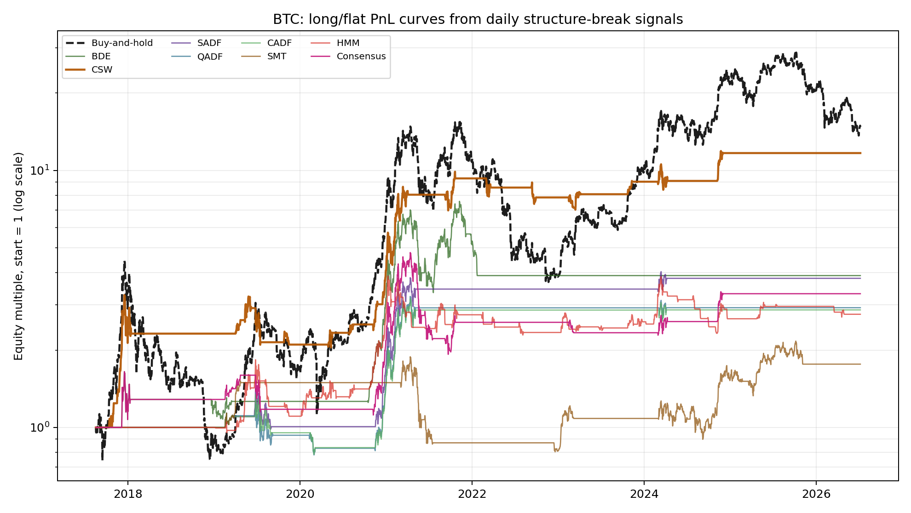

# Crypto Regime-Change Detection

This repository contains a reproducible empirical report on crypto market
structure-break diagnostics inspired by structural-break methods in Marcos
Lopez de Prado's *Advances in Financial Machine Learning* (Chapter 17: BDE and
Chu-Stinchcombe-White CUSUM tests, Chow-type Dickey-Fuller/SDFC, SADF, QADF,
CADF, and the SM-Exp/SM-Power/SM-Poly sub- and super-martingale trend battery),
plus a walk-forward Gaussian hidden Markov model (HMM) regime filter. The HMM
is trained on expanding windows at fixed refit dates, uses filtered (causal)
state probabilities only, and maps states to signals from training data only,
so it carries no forward-looking bias.

The analysis uses Binance daily OHLCV data for BTC, ETH, ETC, SOL, and HYPE.
Spot markets are used where Binance spot history is available; HYPE falls back
to Binance USD-M futures because Binance spot `HYPEUSDT` was unavailable when
the data was downloaded.

## Outputs

- `regime_detection_crypto_report.pdf` is the rendered report.
- `regime_detection_crypto_report.tex` is generated from
  `regime_detection_crypto_report_template.tex`.
- `scripts/generate_daily_regime_chapter.py` downloads data, computes
  diagnostics, runs simple long/flat backtests, calibrates finite-sample ADF
  critical values, and regenerates figures/tables/report source.
- `data/binance_daily/` contains downloaded daily data plus diagnostic and
  strategy CSVs.
- `data/calibration/` contains cached Monte Carlo critical-value files.
- `regime_chapter_figs/` contains all generated figures.
- `tests/` contains focused tests for core math, online-safety, and backtest
  assumptions.

## BTC Backtest Example

The trading section converts structure-break estimates into simple long/flat
signals. Signals are computed using information available through close `t`,
positions are shifted by one day, and the strategy trades the next daily
close-to-close return.

<p>
  
</p>

The strategy ranking is in-sample and should be treated as indicative only. The
report includes walk-forward and bootstrap checks, but the signal family still
needs external validation before any trading interpretation.

## Reproduce

```bash
python3 scripts/generate_daily_regime_chapter.py
pdflatex -interaction=nonstopmode regime_detection_crypto_report.tex
pdflatex -interaction=nonstopmode regime_detection_crypto_report.tex
```

The first full run builds 2,000-simulation calibration caches and can take a
while. For a fast local rebuild from already downloaded data:

```bash
python3 scripts/generate_daily_regime_chapter.py --skip-download --use-cache
```

Run tests with:

```bash
pytest -q
```

The generator writes strict JSON metadata to `regime_chapter_results.json`.
